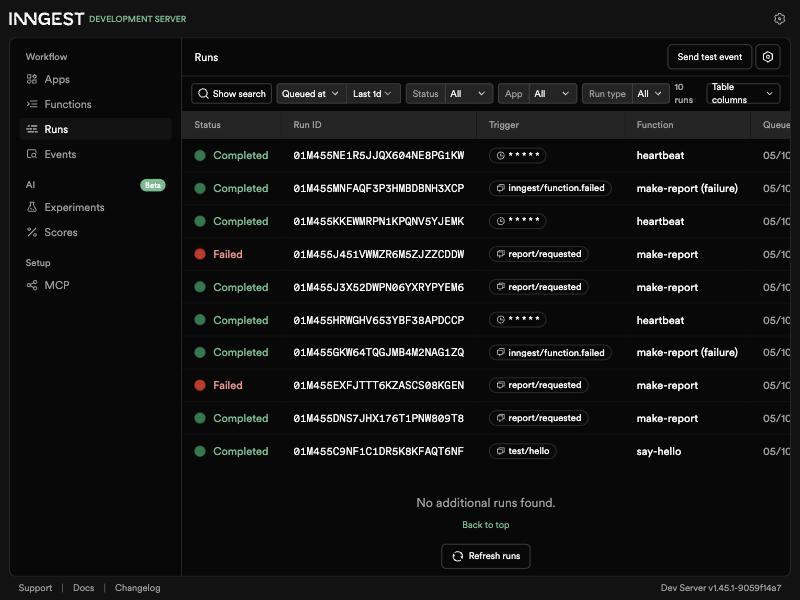
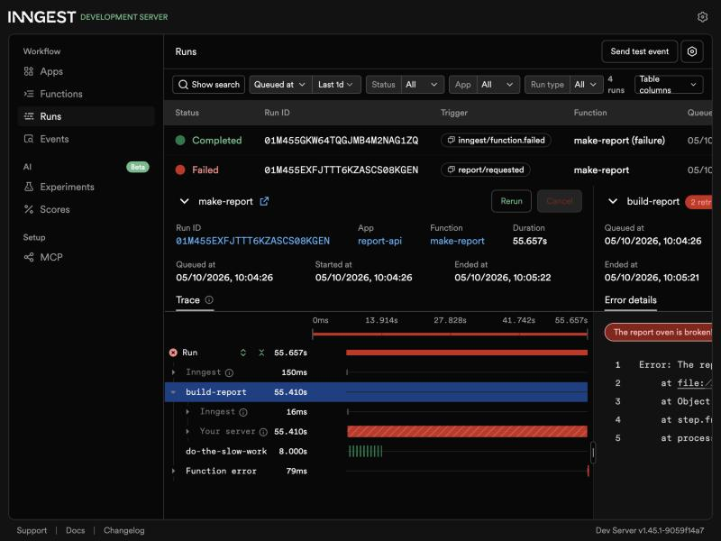
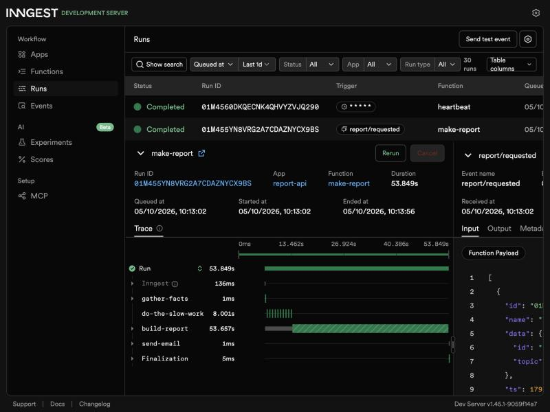

# Your first background job

FlyRank Internship · Backend Track · W4 · A7 · JavaScript lane (Node.js + Express + Inngest)

A small report API whose slow work happens in a **background job**. `POST /reports` answers instantly with
`202 Accepted`, an Inngest function does the ~8 seconds of work, and `GET /reports/:id` reports the status
until the report is ready. A **cron job** runs every minute with no request at all and logs a summary.

The pattern: **accept fast → work in the background → report status.**



## Run it

Requires Node.js 20+. Two terminals, both from this folder:

```bash
git clone https://github.com/roshna21/capstone.git
cd capstone/background-job
npm install
npm run dev        # terminal 1: the API on http://localhost:3000
```

```bash
cd capstone/background-job
npm run inngest    # terminal 2: Inngest Dev Server + dashboard on http://localhost:8288
```

`npm run inngest` is `npx inngest-cli@latest dev -u http://localhost:3000/api/inngest`. No account or key is needed.

Then order a report and poll it:

```bash
curl -i -X POST http://localhost:3000/reports -H "Content-Type: application/json" -d '{"topic":"cats"}'
curl http://localhost:3000/reports/<id>
```

## Endpoints

| Method | Path | What it does | Responses |
| --- | --- | --- | --- |
| `GET` | `/health` | Liveness check | `200 {"status":"ok"}` |
| `POST` | `/reports` | Body `{"topic":"cats"}`. Saves a `pending` report, sends the `report/requested` event, returns at once | `202 {"id","status":"pending"}` · `400` missing/empty topic (no job created) · `503` if Inngest is unreachable |
| `GET` | `/reports` | Control panel: every report and its status | `200 [ ... ]` |
| `GET` | `/reports/:id` | Status endpoint for polling | `200` `pending` → `done` + `result` (or `failed` + `error`) · `404` unknown id |
| `*` | `/api/inngest` | Where the Inngest Dev Server calls our functions | – |

## Inngest functions

| Function | Trigger | Steps | Notes |
| --- | --- | --- | --- |
| `say-hello` | event `test/hello` | `step.sleep("wait-a-moment", "5s")` | Stage 1 smoke test, returns `"Hello from the background!"` |
| `make-report` | event `report/requested` | `step.run("gather-facts")` → `step.sleep("do-the-slow-work", "8s")` → `step.run("build-report")` → `step.run("send-email")` | `retries: 2` (3 attempts), `concurrency: { limit: 2 }`. Topic `"fail"` throws `The report oven is broken!`. `onFailure` marks the report `failed`. `send-email` writes `outbox/<id>.txt` |
| `heartbeat` | cron `* * * * *` | `step.run("count-reports")` | Logs `heartbeat: X pending, Y done, Z failed` every minute |
| `cleanup-old-reports` | cron `*/5 * * * *` | `step.run("delete-old-reports")` | Every 5 minutes, deletes `done` reports that finished more than 10 minutes ago |

## Proof: 202 now, done later

Copied from a real terminal session (zsh, some response headers trimmed):

```
$ time curl -i -X POST http://localhost:3000/reports -H "Content-Type: application/json" -d '{"topic":"cats"}'
HTTP/1.1 202 Accepted
Content-Type: application/json; charset=utf-8

{"id":"acea5846-4ff1-426e-b000-1e0cbd844b56","status":"pending"}
curl -si -X POST ...  0.01s user 0.01s system 58% cpu 0.021 total

$ curl http://localhost:3000/reports/acea5846-4ff1-426e-b000-1e0cbd844b56
{"id":"acea5846-4ff1-426e-b000-1e0cbd844b56","topic":"cats","status":"pending"}

$ curl http://localhost:3000/reports/acea5846-4ff1-426e-b000-1e0cbd844b56     # ~10 s later
{"id":"acea5846-4ff1-426e-b000-1e0cbd844b56","topic":"cats","status":"done","result":{"title":"The cats report","summary":"Everything worth knowing about cats, made in the background.","generatedAt":"2026-10-05T04:33:53.944Z"}}

$ curl -i http://localhost:3000/reports/does-not-exist
HTTP/1.1 404 Not Found
{"error":"Report not found"}

$ curl -i -X POST http://localhost:3000/reports -H "Content-Type: application/json" -d '{}'
HTTP/1.1 400 Bad Request
{"error":"\"topic\" is required and must be a non-empty string"}
```

The POST came back in **21 ms** even though the work takes 8 seconds. Between "accepted" and "done" the
report is `pending`: that's eventual consistency.

## Retries vs. validation (Stage 3)

A missing topic is a wrong *input*, so it is rejected at the door with a 400 and no job is created; a broken oven is a wrong *moment*, so the job is retried with backoff because trying again later might work.

A report with topic `"fail"` runs `build-report` 3 times (1 attempt + 2 retries, with growing waits) and then ends **Failed**.
It took about a minute end to end. After the last attempt, `onFailure` sets the report to `failed`, so pollers don't wait forever.



## Cron (Stage 4)

The `heartbeat` function runs on `* * * * *` (every minute; a real one would run daily) and logs one line:

```
heartbeat: 0 pending, 0 done, 0 failed
heartbeat: 1 pending, 1 done, 0 failed
heartbeat: 0 pending, 1 done, 1 failed
```

- To run it every day at 08:00 the expression would be `0 8 * * *`.
- To run it every Sunday at 22:00 the expression would be `0 22 * * 0`.

Inngest runs cron in UTC unless you prefix a timezone, e.g. `TZ=Asia/Kolkata 0 8 * * *`.

## Extras

- **List endpoint**: `GET /reports` returns every report and its status.
- **The "email"**: the `send-email` step writes `outbox/<id>.txt` (subject + summary), a stand-in for sending mail from a job.
- **Cleanup cron**: `cleanup-old-reports` runs on `*/5 * * * *` (every 5 minutes) and deletes done reports older than 10 minutes.

### Restart experiment

I started a `phoenix` report, stopped the API during the 8-second sleep (10:13:04), waited three seconds and started it again.
The job did not disappear: Inngest's call to the API failed while it was down, so Inngest retried `build-report` with backoff. The run finished at 10:13:56 with the report `done` and its outbox file written.
The new API process never logged `gather-facts` for that id, so the finished step was not run again. Inngest replayed its saved result instead. That's what **durable** means: the job survived, even though my server didn't.
(The report even reappeared in the freshly emptied in-memory map, because `build-report` writes the whole object.)



## Stretch goals

**Idempotency.** I sent the same `report/requested` event (same id) a second time, straight to the Dev Server. Both runs executed, but the API log shows the report was only built once:

```
gather-facts ran for 071ad5ef-1f12-40a4-8c67-6a0d970d0c67
gather-facts ran for 071ad5ef-1f12-40a4-8c67-6a0d970d0c67
build-report skipped for 071ad5ef-1f12-40a4-8c67-6a0d970d0c67: already done
```

`build-report` checks the saved status first, and `send-email` opens the outbox file with the `wx` flag so it is never written twice.
Jobs must survive running twice because retries, redeliveries and double-clicks *will* deliver the same work again someday, and a non-idempotent job would then charge, email or build twice.

**Concurrency limit.** `make-report` has `concurrency: { limit: 2 }`. I enqueued 5 reports at the same moment:

```
alpha    done finished at +10.2s
beta     done finished at +10.2s
epsilon  done finished at +12.2s
delta    done finished at +12.2s
gamma    done finished at +14.3s
```

Two at a time, and the other three waited their turn. Something I learned: Inngest's limit counts *executing steps*, and a run that is inside `step.sleep` doesn't hold a slot.
With only the 8-second sleep, all five finished together at about 8 s. So `build-report` now does 2 s of real "rendering" work, which makes the queue visible.
You want a queue to be slow on purpose when the thing behind it is fragile or rate-limited (an AI API with a requests-per-minute cap, a small database, a partner's API), because protecting it matters more than finishing fast.

**Durable, proven.** See the restart experiment above: `make-report` has 4 steps, and the finished `gather-facts` step did not run again after the restart.

**AI rematch (bonus stage 6).** Not done yet.

## Project structure

```
src/
  server.js    # Express app: /health, /reports, /reports/:id, /api/inngest
  inngest.js   # Inngest client (id: report-api) and the functions
  reports.js   # In-memory Map of reports (forgets everything on restart, on purpose)
docs/          # Dashboard screenshots
outbox/        # "Emails" written by the send-email step (git-ignored, created on first report)
```

## Notes

- Storage is an in-memory `Map`, so restarting the API forgets every report. That's expected for this assignment.
- `isDev` defaults to true, so the SDK talks to the local Dev Server. Set `INNGEST_DEV=0` with real keys for Inngest Cloud.
